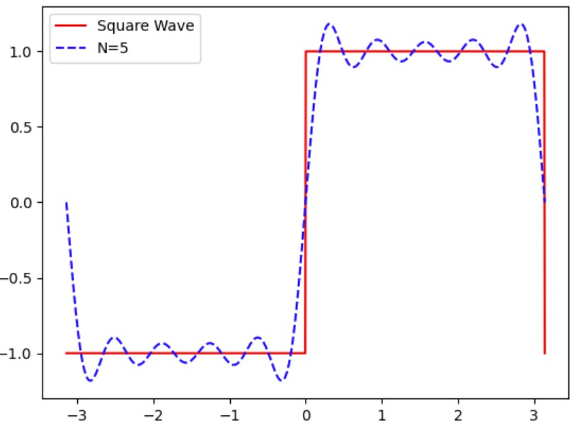
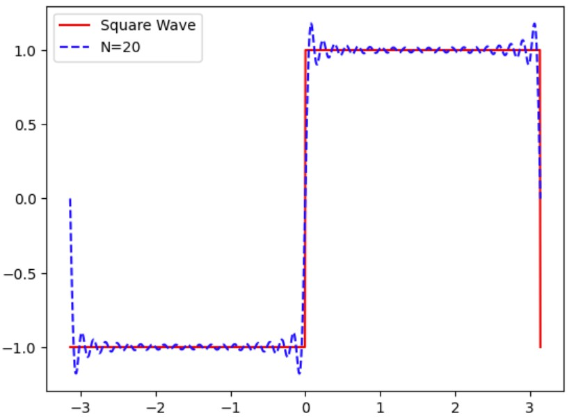
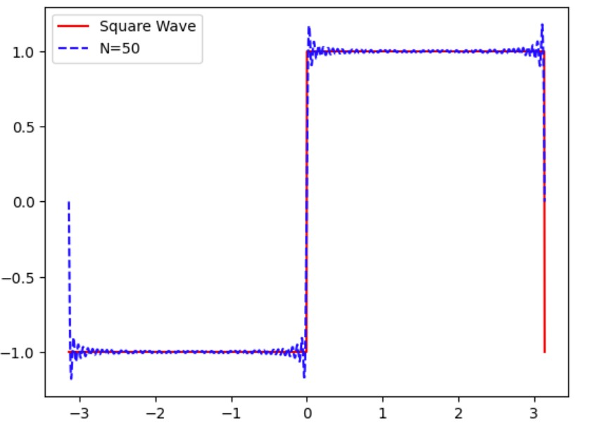
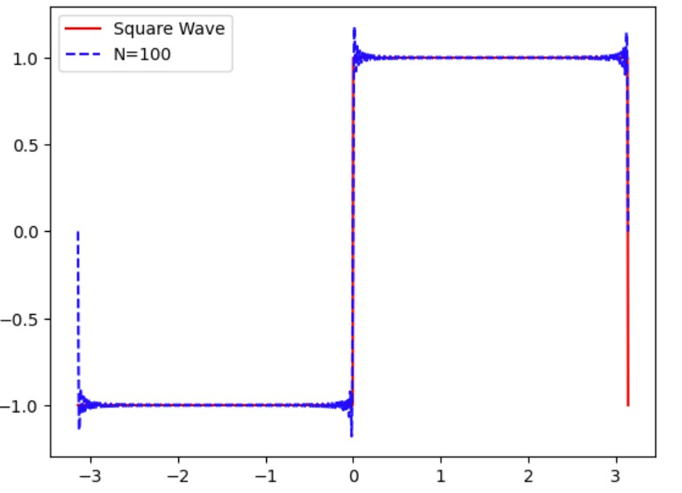
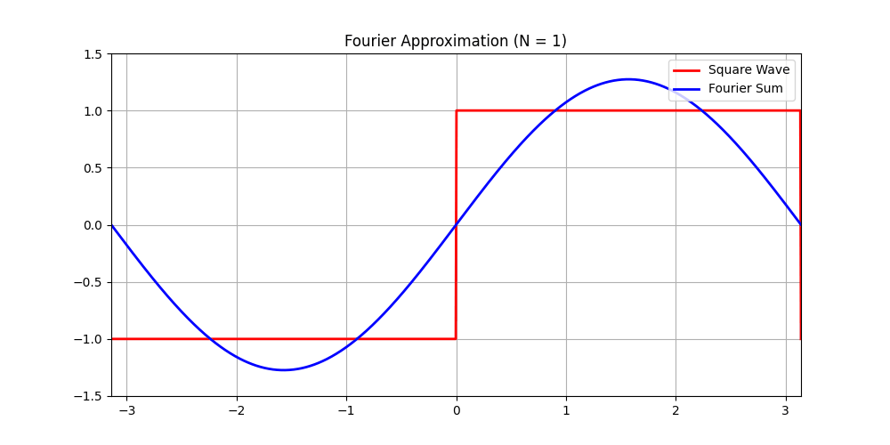

# Fourier Series Animation: Gibbs Phenomenon Visualization

A Python project demonstrating how Fourier series approximate a square wave, including the Gibbs phenomenon (overshoot near discontinuities).


## 📖 Background
The Gibbs phenomenon, named after Josiah Willard Gibbs who explained it in 1898, was first discovered analytically by Henry Wilbraham in 1848. It refers to the oscillatory behavior observed in the Fourier series or Fourier transform approximations of functions with jump discontinuities. Specifically, near a discontinuity, the partial sums of the Fourier series or the truncated Fourier integrals exhibit overshoots and undershoots that do not diminish as the number of terms in the approximation increases. Instead, these oscillations converge to a finite limit, typically about 8.95% overshoot and 4.86% undershoot relative to the jump discontinuity's size.

**Key Characteristics:**
Overshoots and Undershoots: The phenomenon manifests as peaks (overshoots) and valleys (undershoots) near the discontinuity. For example, in the Fourier series approximation of a square wave, the first overshoot is approximately 8.95% above the function's value just after the jump.

**Persistence:** Increasing the number of terms in the approximation (e.g., higher truncation limits) does not eliminate the overshoots; it only moves them closer to the discontinuity.

**Mathematical Explanation:** The Gibbs phenomenon arises due to the inability of the Fourier basis functions (sines and cosines) to perfectly represent abrupt changes. The oscillations are a consequence of the "ringing" effect caused by the abrupt truncation of the infinite series or integral.

**Historical Context:**
Wilbraham's Discovery (1848): Henry Wilbraham first identified the phenomenon while studying the Fourier series approximation of a square wave. However, his work was largely overlooked for decades.

**Gibbs' Explanation (1898):** J.W. Gibbs provided a detailed explanation of the phenomenon while analyzing the output of a harmonic analyzer, bringing it to wider attention.

**Modern Understanding:** The Gibbs phenomenon is now recognized as a fundamental aspect of Fourier analysis, with implications in signal processing, image reconstruction, and numerical methods.

**Applications and Mitigation:**
Signal Processing: The Gibbs phenomenon is critical in designing filters and understanding artifacts in reconstructed signals.

**Mitigation Techniques:** Methods like Fejér averaging (Cesàro summation) and Lanczos sigma-factor smoothing are used to reduce or eliminate the oscillations. Other advanced techniques include Gegenbauer polynomial transforms and wavelet-based approaches.

The Gibbs phenomenon remains a central topic in approximation theory, illustrating the challenges and trade-offs in representing discontinuous functions using continuous basis functions.
## Example
Consider a square wave function:


The Partial Fourier sum of a square wave is given by:


Despite increasing \( N \), the approximation exhibits **Gibbs phenomenon**—persistent overshoots (~9%) near jumps.
| **Graph of Partial Fourier Sum $S_5(x)$**  | **Graph of Partial Fourier Sum $S_{20}(x)$**  |
|-------------|-------------|
|  |  |
| **Graph of Partial Fourier Sum $S_{50}(x)$**  | **Graph of Partial Fourier Sum $S_{100}(x)$**  |
|  |  |

## 🎥 Visualizing the Gibbs Phenomenon: Overshoots in Fourier Approximations  

## Key Observations

Initial Approximation (Low N)

With few terms (e.g., N=5), the Fourier series is a wavy approximation of the square wave.

The curve struggles to match the sharp jump, resulting in large oscillations.

Increasing Terms (Higher N)

As N increases (e.g., N=50), the approximation improves in smooth regions.

However, near the discontinuity (e.g., x=0 or x=π), an overshoot appears.

The overshoot does not disappear even as N → ∞ (it stabilizes at ~9% of the jump height).

Gibbs Overshoot Persists

The peak overshoot remains at ~1.08949 (for a jump from −1 to +1).

The width of the overshoot shrinks as N increases, but the height stays constant.


## Python Code for Fourier Series Approximation Animation
```python
# Example: Plot Gibbs phenomenon
import numpy as np
import matplotlib.pyplot as plt
from matplotlib.animation import FuncAnimation
from IPython.display import HTML  # Required for Colab

# Define the square wave
def square_wave(x):
    return np.where((x >= 0) & (x < np.pi), 1, -1)

# Define the Fourier partial sum
def fourier_sum(x, N):
    s = 0
    for n in range(1, N+1):
        s += np.sin((2*n-1)*x) / (2*n-1)
    return (4/np.pi) * s

# Set up the x-axis
x = np.linspace(-np.pi, np.pi, 1000)
y_true = square_wave(x)

# Initialize the plot
fig, ax = plt.subplots(figsize=(10, 5))
ax.set_xlim(-np.pi, np.pi)
ax.set_ylim(-1.5, 1.5)
ax.set_title("Fourier Approximation of Square Wave")
line_true, = ax.plot(x, y_true, 'r-', label="Square Wave", linewidth=2)
line_approx, = ax.plot([], [], 'b-', label="Fourier Sum", linewidth=2)
ax.legend(loc="upper right")
ax.grid(True)

# Animation update function
def update(N):
    y_approx = fourier_sum(x, N)
    line_approx.set_data(x, y_approx)
    ax.set_title(f"Fourier Approximation (N = {N})")
    return line_approx,

# Create the animation
ani = FuncAnimation(
    fig,
    update,
    frames=range(1, 100),  # Try increasing to 100 for smoother results
    blit=True,
    interval=100  # Delay between frames (ms)
)

# Render in Colab
plt.close()  # Prevents duplicate display
HTML(ani.to_jshtml())  # Ensures animation plays in Colab
ani.save("fourier_animation.gif", writer="pillow", fps=10)  # Requires pillow
# ani.save("fourier_animation.mp4", writer="ffmpeg", fps=10)  # Requires ffmpeg
```
## 🛠️ Setup  
1. Clone the repo:
   ```bash
   git clone https://github.com/rbelbase12/fourier-gibbs-phenomenon.git
## References
1. Gibbs, J. W. (1899). *Fourier Series*. (https://www.nature.com/articles/059606a0.pdf)
2. A.J.Jerri, The Gibbs phenomenon in Fourier Analysis, splines and wavelet approximations, Kluwer Academic publishers, Netherlands, 1998 (https://link.springer.com/book/10.1007/978-1-4757-2847-7)

